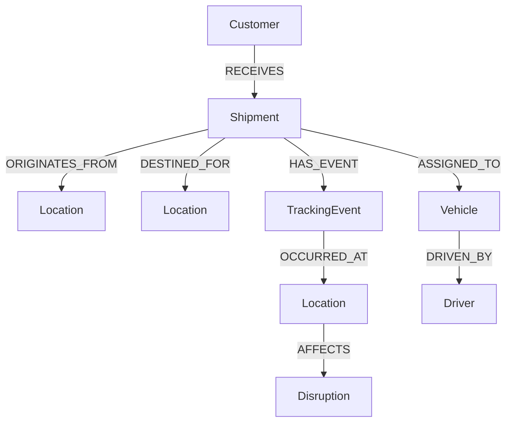

# LogiGraph — Shipment Intelligence Platform

LogiGraph is a graph-powered shipment management application built for the Wexa AI CognoDB take-home assignment.

It allows users to explore shipments, locations, tracking events, vehicles, drivers, customers, and operational disruptions through relationships stored in CognoDB.

\## Tech Stack

\### Backend

\- Java 21

\- Spring Boot

\- REST APIs

\- Neo4j Java Driver

\- CognoDB

\- Maven

\### Frontend

\- React

\- Vite

\- JavaScript

\- CSS

\### Database

\- CognoDB

\- openCypher

\- Bolt protocol

\---

\# Why a Graph Database?

Shipment operations are naturally relationship-heavy.

A shipment is connected to:

\- an origin location

\- a destination location

\- a customer

\- tracking events

\- locations where events occurred

\- a vehicle

\- a driver

\- operational disruptions

In a relational database, answering questions that cross several of these relationships would require multiple JOINs across different tables.

With a graph database, these connections are represented directly as relationships.

For example:

> Which shipments are affected by a disruption at a particular location?

The graph can traverse:

`Disruption → Location → TrackingEvent → Shipment`

This makes multi-hop relationship queries natural and keeps the data model close to the real-world logistics domain.

\---

## Data Model

Customer
   |
 RECEIVES
   ↓
Shipment
 ├── ORIGINATES_FROM ──→ Location
 ├── DESTINED_FOR ─────→ Location
 ├── HAS_EVENT ────────→ TrackingEvent
 │                          |
 │                       OCCURRED_AT
 │                          ↓
 │                       Location
 │                          |
 │                        AFFECTS
 │                          ↓
 │                      Disruption
 │
 └── ASSIGNED_TO ─────→ Vehicle
                            |
                         DRIVEN_BY
                            ↓
                          Driver

## Why a Graph Database?

Logistics data is highly relationship-driven.

A shipment is connected to a customer, origin, destination, tracking events,
vehicles, drivers, and potentially operational disruptions. These connections
are not isolated records; they form a network of related entities.

A relational database could represent the same information using multiple
tables and foreign keys. However, questions involving several relationships
would require multiple JOIN operations and increasingly complex queries.

CognoDB is a better fit for LogiGraph because relationships are first-class
elements of the data model.

For example, LogiGraph can answer questions such as:

- Which shipments are affected by a particular disruption?
- Where was a shipment when a tracking event occurred?
- Which vehicle and driver are responsible for a shipment?
- Which customers own shipments currently affected by an operational problem?
- What locations, events, and disruptions are connected to a shipment?

These questions can be represented naturally as graph traversals.

For example:

Shipment
→ HAS_EVENT
→ TrackingEvent
→ OCCURRED_AT
→ Location

and:

Shipment
→ USES
→ Vehicle
→ DRIVEN_BY
→ Driver

This makes relationship-heavy logistics queries easier to model and reason
about compared with a relational schema built primarily around JOIN operations.
