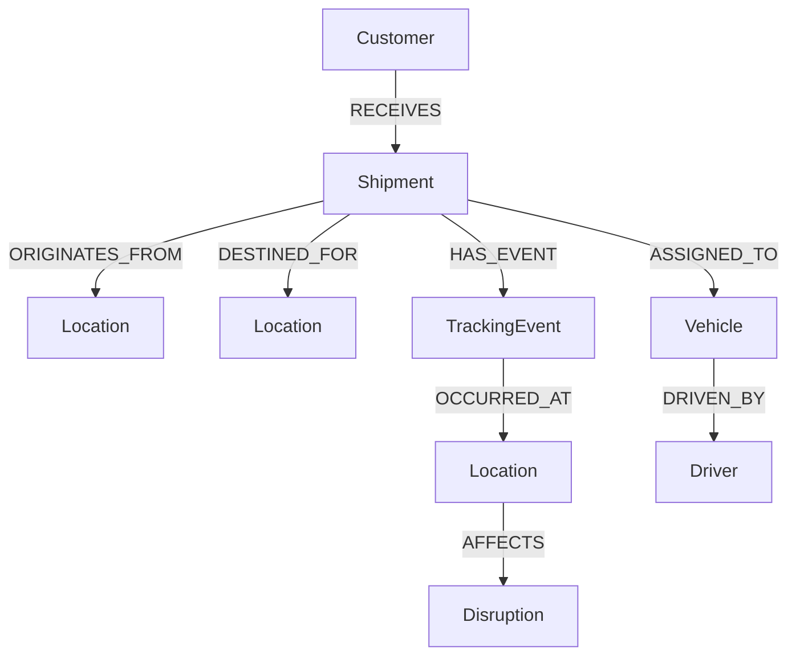

# LogiGraph — Shipment Intelligence Platform


LogiGraph is a graph-powered shipment management application built for the Wexa AI CognoDB take-home assignment.


It allows users to explore shipments, locations, tracking events, vehicles, drivers, customers, and operational disruptions through relationships stored in CognoDB.


\## Tech Stack


\### Backend

\- Java 21

\- Spring Boot

\- REST APIs

\- Neo4j Java Driver

\- CognoDB

\- Maven


\### Frontend

\- React

\- Vite

\- JavaScript

\- CSS


\### Database

\- CognoDB

\- openCypher

\- Bolt protocol


\---


\# Why a Graph Database?


Shipment operations are naturally relationship-heavy.


A shipment is connected to:


\- an origin location

\- a destination location

\- a customer

\- tracking events

\- locations where events occurred

\- a vehicle

\- a driver

\- operational disruptions


In a relational database, answering questions that cross several of these relationships would require multiple JOINs across different tables.


With a graph database, these connections are represented directly as relationships.


For example:


> Which shipments are affected by a disruption at a particular location?


The graph can traverse:


`Disruption → Location → TrackingEvent → Shipment`


This makes multi-hop relationship queries natural and keeps the data model close to the real-world logistics domain.


\---


\# Data Model


```text

                         ┌─────────────┐

                         │   Customer      │

                         └──────┬──────┘

                                  │

                                OWNS

                                  │

                                  â–¼

┌─────────────┐          ┌─────────────┐          ┌─────────────┐

│   Location      │◄──────│   Shipment       │──────►│   Location       │

│   Origin        │          └──────┬──────┘          │ Destination      │

└─────────────┘            │                           └─────────────┘

                                │

                           HAS\_EVENT

                                │

                                â–¼

                       ┌─────────────────┐

                       │   TrackingEvent       │

                       └────────┬────────┘

                                │

                           OCCURRED\_AT

                                │

                                â–¼

                         ┌─────────────┐

                         │  Location       │

                         └──────┬──────┘

                                │

                             AFFECTS

                                │

                                â–¼

                       ┌────────────────┐

                       │  Disruption         │

                       └────────────────┘


Shipment ──USES──> Vehicle ──DRIVEN\_BY──> Driver


## Data Model




                 Customer
                    |
                 RECEIVES
                    |
                    v
                 Shipment
              /     |      \
             /      |       \
ORIGINATES  /    HAS_EVENT   \ ASSIGNED_TO
           v         |         v
       Location      v       Vehicle
                     |          |
               OCCURRED_AT   DRIVEN_BY
                     |          |
                     v          v
                  Location    Driver
                     |
                   AFFECTS
                     |
                     v
                 Disruption

Shipment ──DESTINED_FOR──> Location


